---

layout: sc5

style: |

    #Cover .main-logo__wrapper {
        width: 100%;
        text-align: center;
    }
    #Cover object.main-logo {
        z-index: 5;
        position: static;
        width: 200px;
        margin: 35px 50px;
    }

    #Cover h2 {
        margin:80px 0 0;
        color:#FFF;
        text-align:center;
        font-size:60px;
        line-height: 1.5em;
        }
    #Cover p {
        margin:10px 0 0;
        text-align:center;
        color:#FFF;
        font-size:20px;
        }
        #Cover p a {
            color:#FFF;
            }
    #Picture h2 {
        color:#FFF;
        }
    #SeeMore h2 {
        font-size:100px
        }
    #SeeMore img {
        width:0.72em;
        height:0.72em;
        }
    body {
      font-family: 'PT Sans', sans-serif;
      font-size: 24px;
    }
    .slide h2 {
      font-size: 52px; /* for cyrilic */
    }
    .slide>div {
      font-size: 32px;
      padding-top: 50px;
    }
    .slide ol li,
    .slide ul li {
      text-indent: -1em;
    }
    .slide pre {
        background-color: #efefef;
        padding: 15px;
    }
    .slide pre code {
        line-height: 1.5em;
        font-size: 26px;
    }
    .slide pre code:before {
        content: "";
    }
    .shout.slide {
      background-color: #ef4942;
    }
    .shout.slide h2 {
      color: #fff;
    }
    .no-title h2 {
      display: none;
    }
---

# <span class="sub">Doing nothing for</span> visual regression testing {#Cover}

<div class="main-logo__wrapper">
    <object class="main-logo" data="themes/sc5/images/logo.min.svg#white" type="image/svg+xml"></object>
</div>

*Brought to you by&nbsp;[Varya&nbsp;Stepanova](http://varya.me/) and generated with&nbsp;[Jekyller](https://github.com/shower/jekyller)*
{: .credits }

<style>

#Cover {
  background-image:url('pictures/cover.jpg');
  background-size: cover;
  background-position: 0 -150px, center;
}

#Cover h2 {
  text-shadow: 7px 3px 7px rgba(0,0,0,0.5);
  font-size: 45px;
  margin-top: 260px;
}
#Cover .sub {
  color: #ef4942;
  display: block;
  text-shadow: -3px -1px 4px white, 3px 3px 4px white, 2px 4px 3px rgba(0,0,0,0.5);
  text-align: center;
  font-size: 60px;
  font-family: 'Lora',sans-serif;
  font-style: italic;
  text-transform: lowercase;
}
#Cover .credits {
    width: 270px;
    text-align: left;
    float: right;
}
#Cover .credits,
#Cover .credits a {
  font-size: 18px;
  color: #000;
  font-family: 'Lora',sans-serif;
  font-style: italic;
}
</style>

## Bug hunt
{: .shout }

## Testings
{: .testings }

* performance testing
* stress testing
* conformance testing
* acceptane testing
* smoke testing
* regression testing
* white box testing
* functional testing
* system testing
* black box testing
* load testing
* compatibility testing
* unit testing
{: .cloud }

<style>
.testings .slide__body {
    text-align: center;
}
.testings .cloud {
    display: inline;
    list-style-type: none;
}
.testings .cloud li {
    list-style: none;
    display: inline;
}
.testings .cloud li::before {
    content: "";
}

/* Random sizes */

.testings .cloud li:nth-of-type(3n + 1) {
    font-size: 1.25em;
}
.testings .cloud li:nth-of-type(4n+3) {
    font-size: 1.5em;
}
.testings .cloud li:nth-of-type(5n - 3) {
    font-size: 1em;
}

</style>

## Customer context
{: .customer-context }

###Does my website make sense for the customer right now?
{: .question }

<style>
.customer-context .question {
    font-size: 62px;
    color: #ef4942;
    margin-top: 1.75em;
}
</style>

## Spot the difference
{: .before-after .prod-dev }

### Old version
{: .before }

### New version
{: .after }

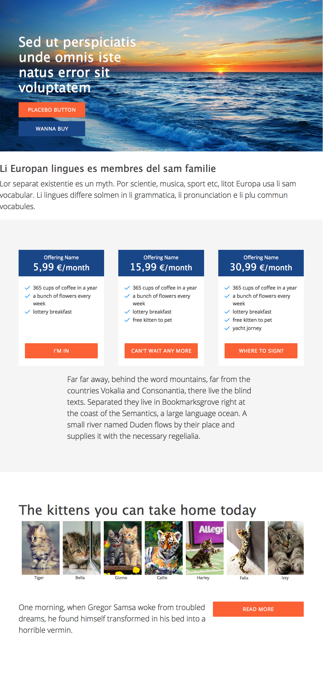{: .before }
{: .after }

<style>
.prod-dev h3 {
    display: inline-block;
}
</style>

## Spot the difference


## Visual regression
{: .shout}

## Perceptual diffs

1. Take reference screenshots
1. Provide changes to the local copy
1. Take local copy screenshots
1. Compare with image diff

## Before and after
{: .before-after .no-title }

{: .before }
{: .after }

<style>
.before-after .before {
    width: 45%;
}
.before-after .after {
    width: 45%;
}
</style>

## Diff
{: .per-diff .no-title }

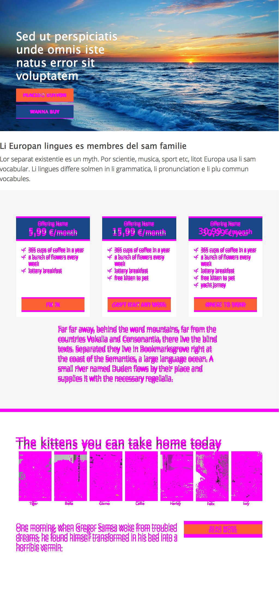{: .pic }

<style>
.per-diff .pic {
    width: 100%;
}

.per-diff>div {
    overflow-y: scroll;
}
.per-diff::before,
.per-diff::after {
    content: "";
    display: none;
}

</style>

## Right way to use
{: .shout}

## What a little margin can do
{: .before-after .no-title }

{: .before }
{: .after }

## Big diff
{: .per-diff .no-title }

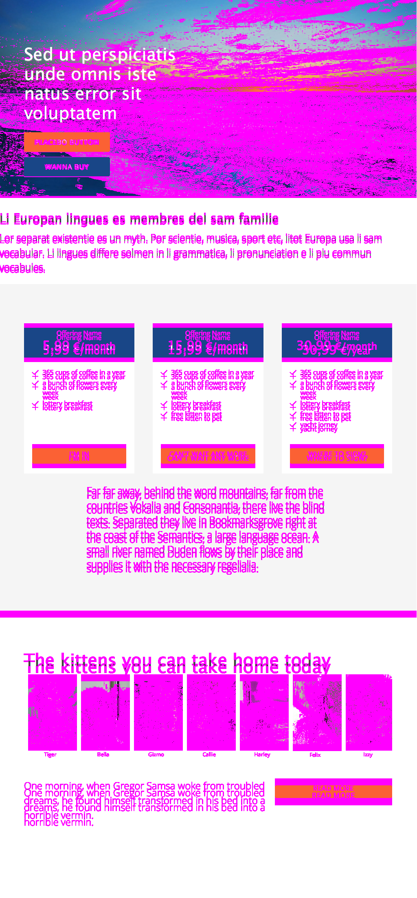{: .pic }

## Impressive <span class="next useless">&&nbsp;useless<span>
{: .shout .impressive}

<style>
.impressive .useless.active {
}
</style>

## Atomic approach

Visual regression testing not for whole pages but for isolated components
gives better understanding of what actually happened.

## Button sizes


{: .next }

## Wrong margin
{: .wrong-margin }

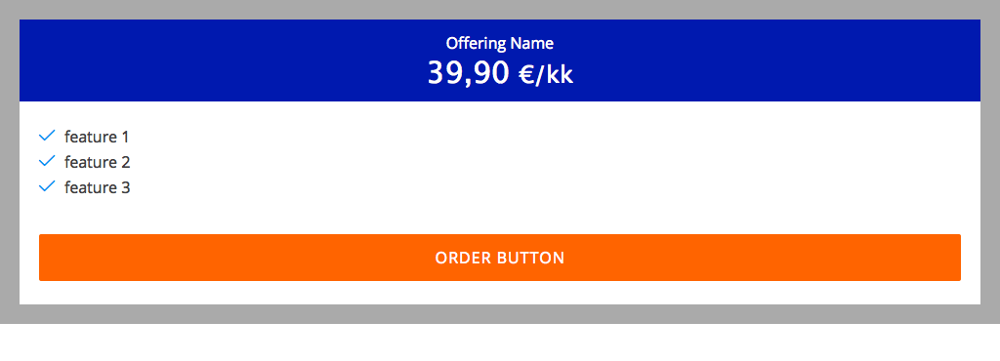{: .pic }

{: .pic }

<style>
.wrong-margin p {
    margin: 0;
}
.wrong-margin .pic {
    width: 620px;
}
</style>

## Wrong margin
{: .wrong-margin }

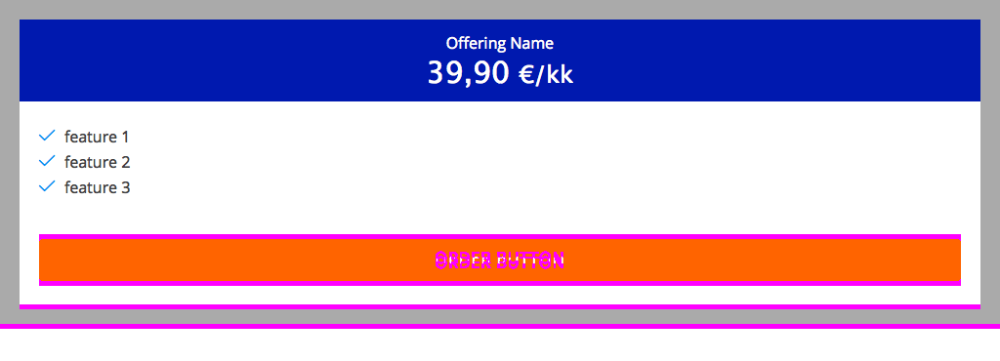{: .pic }

## Icons

### Missing icon font
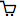
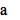


<div class="next" markdown="1">
### Wrong icon

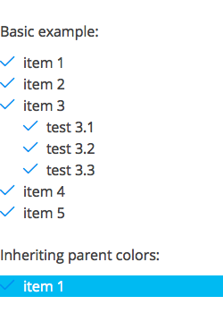
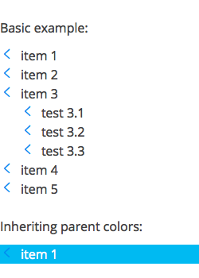
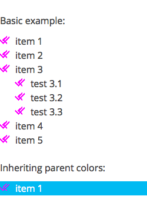{: .next }
</div>

## Affected colors
{: .affected-colors }

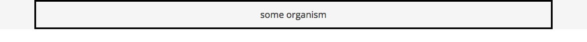{: .pic}

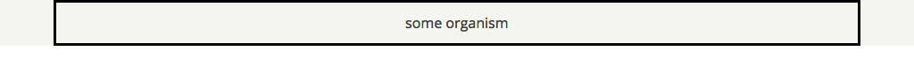{: .pic }

{: .pic .next }

<style>
.affected-colors .pic {
    width: 100%;
}
</style>

## Typography
{: .typography }

### before
{: .subtitle }

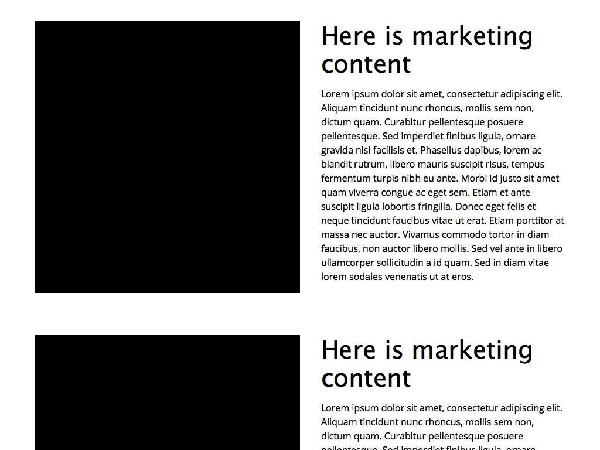{: .pic}

<style>
.typography .pic {
    width: 100%;
}
</style>

## Typography
{: .typography }

### after
{: .subtitle }

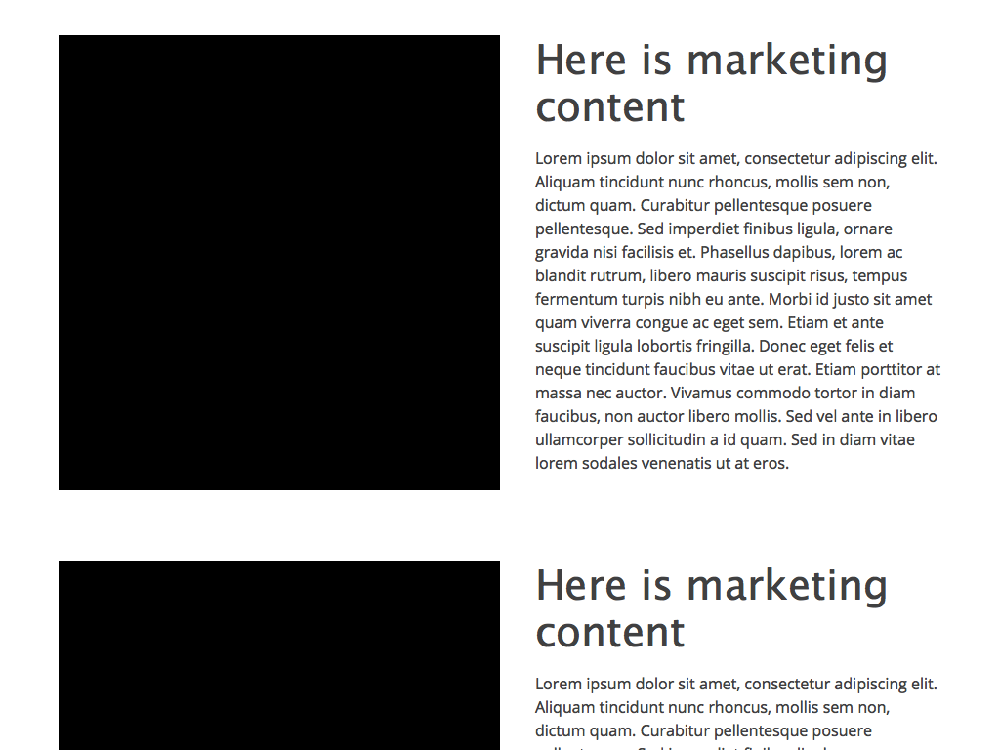{: .pic}

## Typography
{: .typography }

### difference
{: .subtitle }

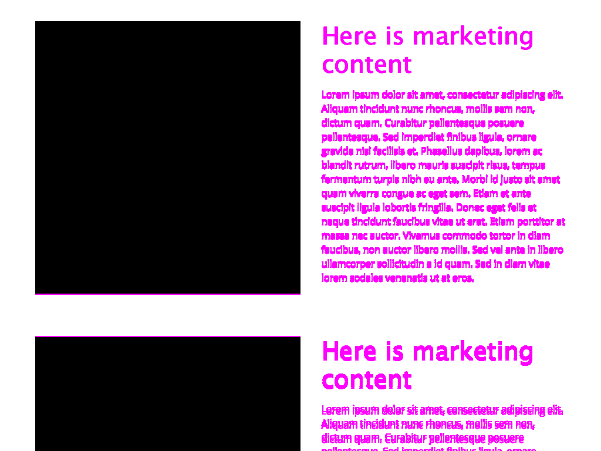{: .pic}

## Typography
{: .typography-details }

### affection onto components
{: .subtitle }

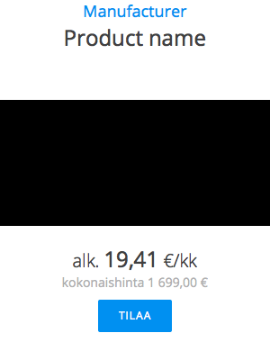{: .pic }
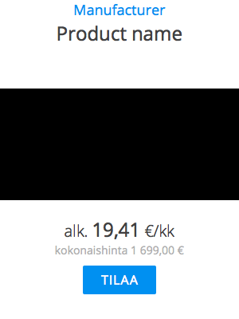{: .pic }
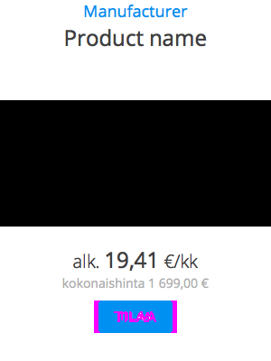{: .pic .next }

<style>
.typography-details .pic {
    width: 32%;
}
</style>

## How to make it work
{: .make-do }

Developers make a separate page for every single component,
fix them every time they change code,
write tests for each and make testing infrastructure.

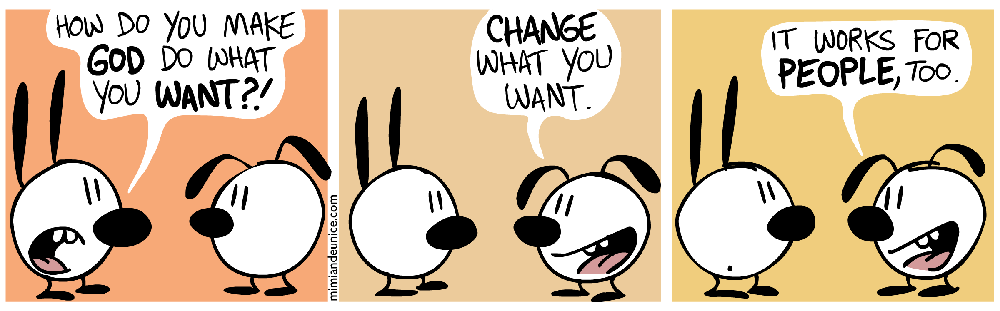{: .image .next }

<style>
.make-do .image {
    width: 100%;
}
</style>

## SC5 Style Guide
{: .style-guide }

Informative and easily navigable live style guide which
**renders every component separately**.

### Example: [varya.me/styleguide](http://varya.me/styleguide/#/)
{: .example }

### Wonderful for perceptual diffs!
{: .wonderful .next }

<style>

.style-guide .example {
    font-size: 38px;
    margin-bottom: 1em;
}

.style-guide .wonderful {
    font: 52px/1.4 'Lora',sans-serif;
    color: #ef4942;
    font-style: italic;
}
</style>

## Add on
{: .shout}

## SC5 Style Guide addition
{: .npm-package }

```
npm install sc5-styleguide-visualtest
```

{: .github }
{: .npm }
{: .gulp }

<style>

.npm-package .slide__body {
    text-align: center;
}

.npm-package .github,
.npm-package .npm,
.npm-package .gulp {
    margin: 0 1.5em;
}
.npm-package .github {
    width: 125px;
    height: 130px;
}
.npm-package .npm {
    width: 187px;
    height: 73px;
}
.npm-package .gulp {
    width: 87px;
    height: 193px;
}

</style>

## Take reference pics

    var visTest = require('sc5-styleguide-visualtest');

    gulp.task("test:visual:update", function() {
      gulp.src('path/to/styleguide', { read: false })
        .pipe(visTest.gather({
          // configuration params
        }));
    });

## Current state test

    gulp.task("visual:test", function(done) {
      gulp.src(styleGuidePath, { read: false })
        .pipe(visTest.test({
          // configuration params
        }));
    });

## Console report

    > gulp test:visual


## Human friendly report

```
open gemini-report/index.html
```

<!-- todo: more about human friendlt report -->

## Features

* Out-of-box solution
* One embedded test suitable for all the components
* Optional custom tests with interactions and logic

## Custom tests

* Different screen sizes
* Ignore dynamic parts
* Wait for element to appear
* Make interactions (e.g. clicks)
* Run custom JavaScript

## The dev flow
{: .shout }

## When refactoring

### Test particular component

    > gulp test:visual --section 7.3.4 --section 8.5

### Test all

    > gulp test:visual

## When making new

### Update one component reference

    > gulp test:visual:update --section 8.5 --from local

### Update all from production

    > gulp test:visual:update

## Real life stories
{: .real-life }

* Missing icon font <span class="next sad">(sad but true)</span>
* Changing font linking
* Typography affection
* Refactoring of atom components

<style>
.real-life .sad {
    font: 32px/1.4 'Lora',sans-serif;
    color: #ef4942;
    font-style: italic;
}
</style>

## Apply for
The practises you did not dare to use

* Continuous integration
* Continuous deployment
* Removing code
* Intensive refactoring

## Pictorial pull request
{: .pull-request }

{: .pic }

<style>
.pull-request>div {
    overflow-y: scroll;
}
.pull-request .pic {
    width: 100%;
}
</style>


## Psychology
{: .shout}

## Insurance
{: .insurance }

Devs must be accurate but nothing checks the result.<br/><span class="nono next">No, code reviews don't.</span>

<div class="next" markdown="1">
###But visual regression testing does!
{: .yesyes }

* We feel safer
* We are braver
* Even a junior dev can experiment
</div>

<style>
.insurance .nono,
.insurance .yesyes {
    font: 32px/1.4 'Lora',sans-serif;
    color: #ef4942;
    font-style: italic;
}
.insurance .yesyes {
    color: green;
}
</style>

## Business
{: .shout}

## Making money out of it

* Introduce style guide approach
* Provide very stable UI
* Work faster and do more

## THANK YOU!
{: .thanks }

Varya Stepanova, SC5 Online<br/>
[@varya_en](https://twitter.com/varya_en){: .twitter }

### The tool: [github.com/sc5/sc5-styleguide-visualtest](https://github.com/SC5/sc5-styleguide-visualtest)

### Working code: [github.com/varya/varya.github.com](http://git.io/visual-tests-demo)

###Slides: [varya.me/helsinkijs-2015](http://varya.me/helsinkijs-2015/)

<style>
.thanks h3 {
  font-size: 38px;
  margin-bottom: 0.5em;
}
.thanks .twitter
{
  text-decoration: none;
  color: currentColor;
  background: none;
}
.thanks .twitter::before
{
  content: "";
  display: inline-block;
  width: 1.5em;
  height: 1.5em;
  background-image:url('pictures/twitter-logo.png');
  background-size: cover;
  margin-right: 0.5em;
  margin-bottom: -0.5em;
}
</style>
